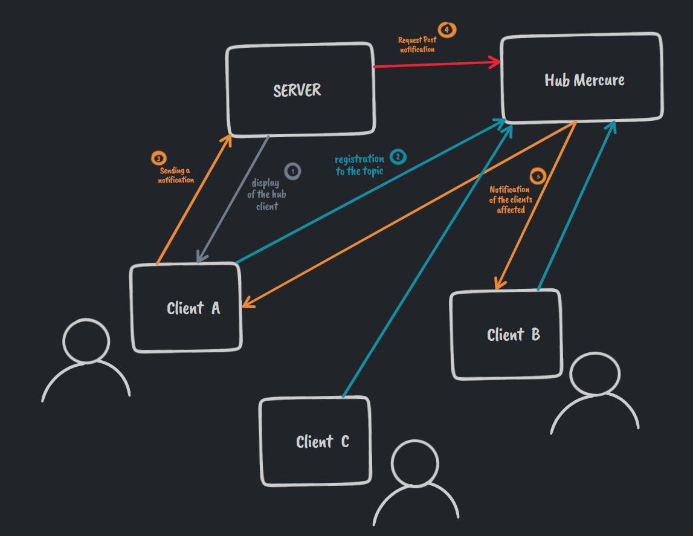

# Otsum
> - Symfony 6
> - PHP 8
> - Yarn
> - Make
> - Webpack
> - Mercure

# Install project

## Get project: 

`git clone https://github.com/Yorik56/Otsum`

## Get dependencies: 
`composer install`

## Install Yarn
[https://classic.yarnpkg.com/lang/en/docs/install/#windows-stable](https://classic.yarnpkg.com/lang/en/docs/install/#windows-stable)

`npm install --global yarn` 

`yarn install`

## Install Make 

### Install chocolatey
[https://chocolatey.org/install#individual](https://chocolatey.org/install#individual)

### Run as Administrator
`choco install make`

## Create Database
> Create a database named "Otsum"

> Lauch migration script

`php bin/console doctrine:migrations:migrate`

# Configs

> Variables environment
- [.env.exemple](https://github.com/Yorik56/Otsum/blob/main/.env.exemple)

> Compile JS/CSS
- [config/packages/webpack_encore.yaml](https://github.com/Yorik56/Otsum/blob/main/config/packages/webpack_encore.yaml)

> Resize/Crop/Watermarks..
- [config/packages/liip_imagine.yaml](https://github.com/Yorik56/Otsum/blob/main/config/packages/liip_imagine.yaml)

> Upload Files
- [config/packages/vich_uploader.yaml](https://github.com/Yorik56/Otsum/blob/main/config/packages/vich_uploader.yaml)

> Mercure : Websocket
- [config/packages/mercure.yaml](https://github.com/Yorik56/Otsum/blob/main/config/packages/mercure.yaml)
- [Makefile](https://github.com/Yorik56/Otsum/blob/main/Makefile)

# Launch project

> run make (Launch Mercure Serveur)

`make`

> Run yarn watch (Compile css/js)

`yarn watch`

*GOOD TO GO*
